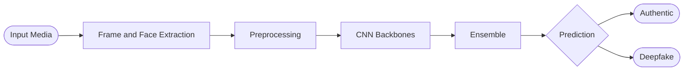

 

 

## ✦ About

<table>
<tr>
<td width="60%" valign="top">

I'm a final-stage **B.Tech CSE (AI & ML)** student who likes building things end to end: from the model and its evaluation to the API and interface around it.

I led a **CNN-based deepfake detection** project, interned in **AI mentorship at Technook**, and built full-stack and embedded projects along the way. Solid fundamentals in OOPs, DBMS, operating systems and networks sit under all of it.

</td>
<td width="40%" valign="top">

<b>🎓 Education</b> 
CMR Institute of Technology 
2022 – Present  
<b>🧪 Experience</b> 
AI Mentorship Intern, Technook 
May – Jun 2024  
<b>🟢 Status</b> 
Open to internships &amp; entry-level roles

</td>
</tr>
</table>

 

## ✦ Focus Areas

<table>
<tr>
<td align="center" width="33%">
<h3>🧠</h3>
<b>Machine Learning</b> 
CNNs · model evaluation · preprocessing pipelines
</td>
<td align="center" width="33%">
<h3>🌐</h3>
<b>Full-Stack Web</b> 
React · Node · Express · MongoDB
</td>
<td align="center" width="33%">
<h3>🤖</h3>
<b>Embedded Systems</b> 
Arduino · sensors · C/C++
</td>
</tr>
</table>

 

## ✦ Featured Projects

<table>
<tr>
<td width="100%" valign="top">
<h3>🕵️ Deepfake Detection System</h3>
<b>Team Leader</b> · 2025 – 2026
  
End-to-end CNN-based detector, grounded in a literature review of <b>112 papers</b>. In that review, CNN architectures (XceptionNet, ResNet, VGG) averaged <b>89.73%</b> accuracy, while ensembles reached <b>99.65%</b>.
  

</td>
</tr>
<tr>
<td width="100%" valign="top">
<h3>💰 Fullstack Crypto Marketplace</h3>
2024
  
Real-time crypto analytics platform with live price tracking through the CoinGecko API, TradingView charting, and a RESTful API layer backed by MongoDB.
  

</td>
</tr>
<tr>
<td width="100%" valign="top">
<h3>🤖 Human Following Robot</h3>
2024
  
Autonomous robot using ultrasonic and IR <b>sensor fusion</b> for real-time human detection, with C/C++ movement logic through an L293D motor driver and full hardware circuit design.
  

</td>
</tr>
</table>

 

## ✦ Tech Stack

 

 

 

 

## ✦ GitHub Activity

  

 

## ✦ Certifications

- **AI Mentorship Internship** — Technook
- **7-Day ML Bootcamp** — Google DSC × TensorFlow User Group Hyderabad
- **Entrepreneurship Orientation Program**

 

