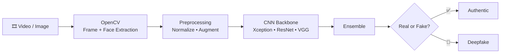

<div align="center">


<a href="https://git.io/typing-svg">
  
</a>

<br/>


<a href="https://www.linkedin.com/in/manikanta-pavan-vennu1906"></a>
<a href="mailto:manikantapavanv@gmail.com"></a>

</div>

---

## `> whoami`

```python
class Developer:
    def __init__(self):
        self.name       = "Vennu Manikanta Pavan"
        self.role       = "B.Tech CSE (AI & ML) @ CMR Institute of Technology"
        self.location   = "Hyderabad, India 🇮🇳"
        self.languages  = ["Python", "Java", "C/C++", "JavaScript", "SQL"]
        self.focus      = ["Deep Learning", "Computer Vision", "Full-Stack Web", "Embedded"]
        self.experience = "AI Mentorship Intern @ Technook"
        self.open_to    = ["Internships", "Entry-level roles", "Relocation", "Learning anything new"]

    def status(self):
        return "🟢 Building. Learning. Shipping."
```

---

## 🧰 `> stack --list`

<div align="center">

**Languages**<br/>


**AI / ML**<br/>


**Web / Full-Stack**<br/>


**Tools & Hardware**<br/>


</div>

---

## 🚀 `> ls projects/`

<table>
<tr>
<td width="50%" valign="top">

### 🕵️ Deepfake Detection System
**`Python` `TensorFlow` `Keras` `OpenCV`** · *Team Leader · 2025–26*

End-to-end CNN-based deepfake detector, built on a review of **112 papers**:

| Approach | Avg. Accuracy |
|---|---|
| CNNs (Xception, ResNet, VGG) | **89.73%** |
| Ensembles | **99.65%** |

</td>
<td width="50%" valign="top">

### 💰 Fullstack Crypto Marketplace
**`React` `Node.js` `Express` `MongoDB`** · *2024*

Real-time crypto analytics platform:
- ⚡ Live prices via **CoinGecko API**
- 📈 **TradingView** charting
- 🔌 RESTful API layer on **MongoDB**

</td>
</tr>
<tr>
<td colspan="2" valign="top">

### 🤖 Human Following Robot
**`Arduino Uno` `Ultrasonic + IR sensors` `C/C++`** · *2024*

Autonomous robot using **sensor fusion** for real-time human detection, with L293D motor-driver control and full hardware circuit design.

</td>
</tr>
</table>

### 🧠 Deepfake detection pipeline



---

## 📊 `> stats --live`

<div align="center">


</div>

---

## 🐍 `> contributions --animate`

<div align="center">
  
</div>

---

## 🎓 `> cat education.log`

| Period | Milestone |
|---|---|
| 2022 – Present | **B.Tech CSE (AI & ML)** — CMR Institute of Technology, Hyderabad |
| May – Jun 2024 | **AI Mentorship Intern** — Technook (ML models, preprocessing pipelines, F1/precision/recall evaluation) |
| Certified | 7-Day ML Bootcamp — Google DSC × TensorFlow UG Hyderabad |
| Certified | Entrepreneurship Orientation Program |

---

## 📡 `> connect --now`

<div align="center">

**Open to internships & entry-level roles in AI/ML and software development.**

<a href="https://www.linkedin.com/in/manikanta-pavan-vennu1906"></a>
<a href="mailto:manikantapavanv@gmail.com"></a>

<br/><br/>


</div>
