 

 

## About

I'm a B.Tech CSE (AI & ML) student who enjoys building things end to end, from the model and its evaluation to the API and interface around it.

I led a CNN-based deepfake detection project, completed an AI Mentorship Internship at Technook, and built full-stack and embedded projects along the way. Strong fundamentals in OOPs, DBMS, operating systems and networks sit underneath all of it.

 

## Projects

| Project | What it does | Built with |
|:--|:--|:--|
| **Deepfake Detection** Team Leader · 2025–26 | CNN-based detection system, grounded in a review of 112 papers where CNNs averaged **89.73%** accuracy and ensembles reached **99.65%** | Python, TensorFlow, Keras, OpenCV |
| **Crypto Marketplace** Full-Stack · 2024 | Real-time analytics platform with live CoinGecko prices, TradingView charts and a REST API on MongoDB | React, Node.js, Express, MongoDB |
| **Human Following Robot** Embedded · 2024 | Autonomous robot using ultrasonic and IR sensor fusion for real-time human detection | Arduino Uno, C/C++, L293D |

 

## Tech Stack

 

 

## Experience & Education

| | |
|:--|:--|
| **May – Jun 2024** | AI Mentorship Intern, Technook |
| **2022 – Present** | B.Tech CSE (AI & ML), CMR Institute of Technology, Hyderabad |
| **Certified** | 7-Day ML Bootcamp (Google DSC × TensorFlow UG Hyderabad), Entrepreneurship Orientation Program |

 

